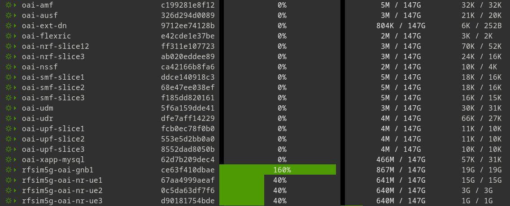
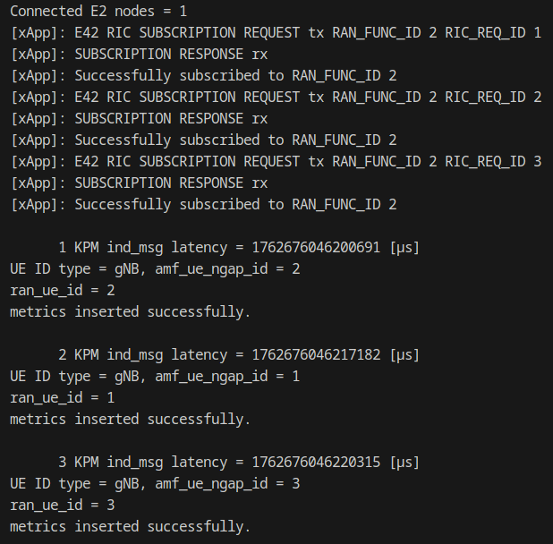
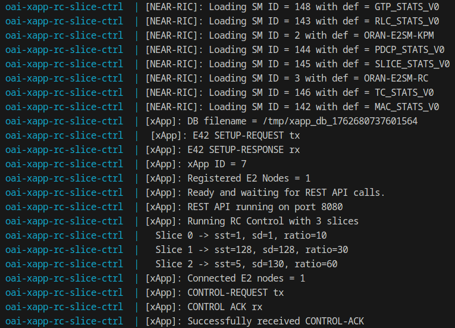
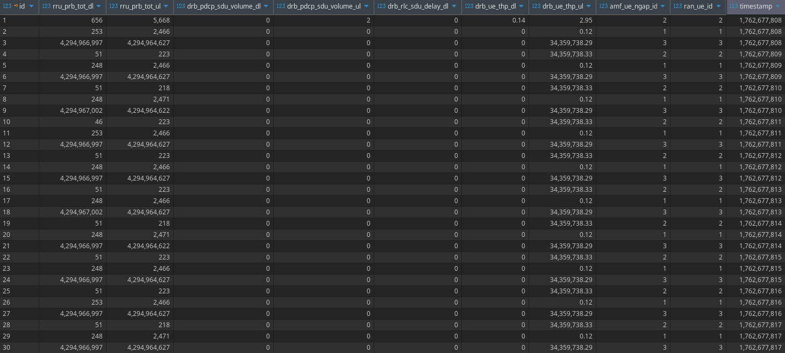
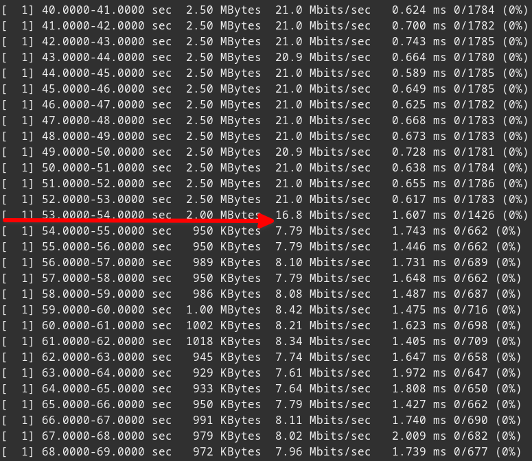
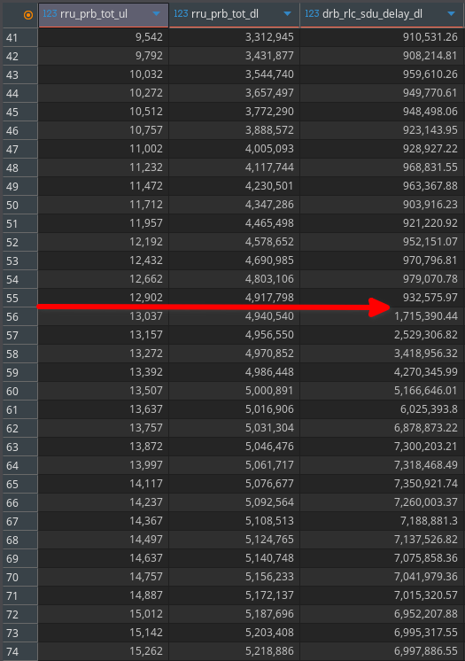

# xDRL-RCS-OAI


[](https://opensource.org/licenses/MIT)


Implementation of the Explainable Deep Reinforcement Learning (xDRL)-based Radio and Core Slicing (RCS) framework integrated into an end-to-end OAI + FlexRIC testbed.  
This repository provides an implementation of a **Deep Reinforcement Learning (DRL)–based xApp** designed to **intelligently optimize and align the Physical Resource Block (PRB) allocation** across network devices.  
It is fully compatible with the **OpenAirInterface (OAI) 5G Core (5GC)** and tailored for **network slicing** scenarios, enabling dynamic, data-driven resource management and enhanced Quality of Service (QoS) across multiple slices.

## 📖 Overview

In multi-slice 5G networks, the performance of connected **User Equipment (UE)** devices must be continuously monitored and analyzed to ensure optimal resource utilization and service efficiency.  
This repository introduces a **Deep Reinforcement Learning (DRL)–based xApp** that **automatically aligns and optimizes network PRB and bandwidth allocation** across different network slices.  
The DRL xApp operates in conjunction with a **modified xApp KPM (Key Performance Measurement) monitoring module**, which collects comprehensive **KPI metrics** from all connected UEs across slices and stores them in a **MySQL database**. These stored metrics serve as the training and decision-making data foundation for the DRL xApp, enabling **intelligent, closed-loop network optimization**.

## 📡 5G Core Network Slicing

**5G Network Slicing** is a key concept introduced in 5G architecture that enables the creation of multiple logical networks on top of a shared physical infrastructure.  
Each **network slice** is an independent, end-to-end network instance - optimized for specific services, performance requirements, or tenants (e.g., IoT, eMBB, URLLC).

A **5G Core (5GC)** supports the deployment and management of these slices through virtualization, automation, and software-defined networking.

### Core Concepts

#### 🔹 Network Slice

A **Network Slice** is a logically isolated network that provides specific capabilities and characteristics tailored to a particular use case.

Each slice is composed of:
- **RAN Slice Subnet** (gNB configuration)
- **Core Network Slice Subnet** (5GC functions)
- **Transport Slice Subnet** (backhaul connectivity)

#### 🔹 Slice Types (3GPP)

According to 3GPP specifications, standard slice types are identified by:
- **SST (Slice/Service Type)** – Defines the expected network behavior.
- **SD (Slice Differentiator)** – Further differentiates slices with the same SST.

### 5G Core Architecture for Network Slicing

The **5G Core Network (5GC)** is designed with **Service-Based Architecture (SBA)**, where each network function (NF) exposes services via APIs.  
This modular design supports flexible instantiation and management of network slices.

#### Key Network Functions in Slicing

| Network Function | Role in Slicing |
|-------------------|----------------|
| **AMF (Access and Mobility Management Function)** | Slice-aware UE registration and mobility management. |
| **SMF (Session Management Function)** | Establishes slice-specific PDU sessions. |
| **UPF (User Plane Function)** | Routes user traffic for a specific slice. |
| **PCF (Policy Control Function)** | Enforces slice-specific policies and QoS. |
| **NRF (Network Repository Function)** | Registers slice-specific service instances. |
| **NSSF (Network Slice Selection Function)** | Determines which slice(s) a UE should connect to. |

### Network Slice Lifecycle

1. **Design**  
   Define slice templates (S-NSSAI, QoS profiles, resource allocation).

2. **Instantiation**  
   Deploy core network functions and RAN configurations for the slice.

3. **Configuration & Activation**  
   Assign users or services to the slice through NSSF and AMF.

4. **Operation & Monitoring**  
   Continuously monitor KPIs, usage, and SLA compliance.

5. **Termination**  
   Decommission the slice when no longer needed.

### Slice Isolation

To ensure **security and performance**, each slice should maintain:
- **Control plane isolation**
- **User plane traffic separation**
- **Dedicated or shared NFs based on SLA**
- **Resource quotas and QoS enforcement**

Isolation can be implemented at multiple layers:
- Virtualization layer (VMs, containers)
- Network functions (dedicated instances)
- Data plane (VLANs, tunnels, or SRv6)

### Core Components

The core network Docker services we use to deploy in slicing mode are as follows:

| Service | Role | Slice Association | Key Config |
|----------|------|------------------|-------------|
| **mysql** | Database backend for UDR | Shared | Initializes schema from `oai_db2.sql` |
| **oai-nssf** | Network Slice Selection Function | All slices | Loads slice mapping from `nssf_slice_config.yaml` |
| **oai-udr / oai-udm / oai-ausf** | Core service functions for authentication and user data | Shared | Connect to MySQL |
| **oai-nrf-slice12** | NRF registry for slices 1 and 2 | SST=1 SD=1, SST=128 SD=128 | Registers SMF/UPF of slice1 & slice2 |
| **oai-nrf-slice3** | NRF registry for slice 3 | SST=5 SD=130 | Registers SMF/UPF of slice3 |
| **oai-amf** | Access and Mobility Management Function | Common control plane | Slice-aware via NSSF |
| **oai-smf-slice1** | Session Management Function for slice 1 | SST=1 SD=1 | Connects to UPF-slice1 |
| **oai-smf-slice2** | Session Management Function for slice 2 | SST=128 SD=128 | Connects to UPF-slice2 |
| **oai-smf-slice3** | Session Management Function for slice 3 | SST=5 SD=130 | Connects to UPF-slice3 |
| **oai-upf-slice1** | User Plane Function for slice 1 | SST=1 SD=1 | Routes traffic via 12.2.1.0/25 |
| **oai-upf-slice2** | User Plane Function for slice 2 | SST=128 SD=128 | Routes traffic via 12.1.1.128/26 |
| **oai-upf-slice3** | User Plane Function for slice 3 | SST=5 SD=130 | Routes traffic via 12.1.1.192/26 |
| **oai_ext_dn** | External data network (traffic generator / DN emulation) | All slices | NAT + routing to UPF networks |

## 🗂️ Repository Contents

- **Docker Compose and configuration files** for deploying a complete **5G multi-slice network**, including all major components:  
  - **Core Network (CN)**  
  - **RAN components** such as **FlexRIC**, **gNB**, and **UE**  

- **xApp KPIMON (3-slice version)**  
  - Source code and pre-built Docker image  
  - Responsible for collecting KPI metrics from all slices and storing them in a MySQL database  

- **xApp DRL**  
  - Source code and pre-built Docker image  
  - Implements a Deep Reinforcement Learning model for intelligent PRB alignment and bandwidth optimization across slices  

- **xApp RC Slice Control**  
  - Source code and pre-built Docker image  
  - Written in **C**, this xApp launches a **REST API server** that receives PRB management commands and relevant parameters from the **xApp DRL**  
  - Applies these PRB configurations dynamically to the active network slices

## 🛠️ Prerequisites

Before setting up and running the environment, ensure that the following dependencies and system requirements are met:

- **Docker** and **Docker Compose** - Installed and running properly on your system  
- **Git** - Required for cloning this and related repositories  
- **System Resources** - Sufficient computational capacity to host multiple 5G network components and xApps concurrently:  
  - **CPU:** At least 8 cores (12 preferred for smooth operation) recommended
  - **RAM:** Minimum 8 GB
  - **Storage:** Minimum 10 GB of free disk space  
- **Internet Access** - Required for pulling Docker images and installing dependencies during setup

## 🚀 Build Services

Before deployment, each component must be packaged as a **Docker image**.

### Core Network

To deploy the core network components in slicing environments, a set of **prebuilt images** is available on **Docker Hub**.  
These images are already referenced in the provided **Docker Compose** file.

### RAN

To deploy the RAN components (**FlexRIC**, **gNB**, and **UE**), you can use our prebuilt images available on **Docker Hub** under the `ithermai6gtc` namespace.

### xApp KPIMON 3-Slice

The **xApp KPIMON (3-Slice)** module is implemented in **C**, and its source code is available inside the `xapp-kpm-mon` directory.  
You can modify, rebuild, and integrate it as part of the [Mosaic5G FlexRIC](https://gitlab.eurecom.fr/mosaic5g/flexric) repository by placing it within the **example** directory.  
Alternatively, you can refer to our dedicated repository - [6G-TC-OAI](https://github.com/iThermAI/6G-TC-OAI) - for additional context, code references, and integration examples.  
If you prefer a faster setup, a **pre-built Docker image** of the KPIMON xApp is available on **Docker Hub**, ready to be deployed without manual compilation.

### xApp RC Slice Control

The **xApp RC Slice Control** module, located in the `xapp-rc-ctrl` directory, is implemented in **C** and serves as the **runtime controller** for managing PRB allocation across network slices.  
You can compile and build this component manually using the provided source code, or simply use the **pre-built Docker image** available on **Docker Hub** for a quicker deployment.  
When deployed, this xApp launches a **REST API server** on port `8080` that receives PRB management commands and configuration parameters from the **xApp DRL** service and applies them dynamically to the network slices.

## ▶️ Run Services

To launch the system, execute the following commands **in order**:

### Core Network

Start the **5G Core Network** (slicing environment) using Docker Compose:
```bash
cd oai-slicing
docker compose -f docker-compose-cn.yaml up -d
```

### RAN

Once the **Core Network** components are fully loaded, start the RAN components in sequence.

#### 1- FlexRIC and gNB

Start the FlexRIC and gNB containers:
```bash
cd oai-slicing
docker compose -f docker-compose-ran.yaml up -d oai-gnb1
```

#### 2- UE

After the FlexRIC and gNB services are running, launch the UEs sequentially (with a delay between each):
```bash
cd oai-slicing
docker compose -f docker-compose-ran.yaml up -d oai-nr-ue1
sleep 5
docker compose -f docker-compose-ran.yaml up -d oai-nr-ue2
sleep 5
docker compose -f docker-compose-ran.yaml up -d oai-nr-ue3
```

### xApp KPM Monitoring (3-Slice)

To launch the **xApp KPM Monitoring** service along with its associated **MySQL database**, simply run:
```bash
cd xapp-kpm-mon/
docker compose up -d
```

This command will start both the monitoring xApp and the MySQL database in detached mode.
The xApp will begin collecting **KPM (Key Performance Metrics)** from multiple network slices and **storing them persistently** in the MySQL database.

You can view the live logs of the xApp service with:
```bash
docker logs -f oai-xapp-kpm-mon
```
The MySQL database is exposed on port `3307`, allowing you to connect using any MySQL client to inspect the stored metrics.

#### Iperf Test

To observe how KPI metrics change in response to varying network traffic, you can generate traffic between different **UEs** and the **Core Network** components.  
This allows you to monitor real-time KPI variations for specific UEs within the MySQL database.

The example below demonstrates how to perform an **iperf** test between the `oai-ext-dn` service (representing the Core Network’s external data network) and **UE number 1**.

**From the UE side (server):**
```bash
docker exec -it oai-nr-ue1 bash
iperf -u -s -B 12.2.1.2 -i 1
```
This starts `iperf` in **UDP server mode**, binding it to the UE’s IP address (`12.2.1.2`) and displaying per-second performance updates.

**From the `oai-ext-dn` side (client):**
```bash
docker exec -it oai-ext-dn bash
iperf -u -c 12.2.1.2 -b 100M -t 60 -i 1 -fk
```
This command runs `iperf` in **UDP client mode**, sending traffic to the UE at `12.2.1.2` with a bandwidth of **100 Mbps** for **60 seconds**, reporting statistics every second.  
After running the test, you can inspect the **KPI variations** in the MySQL database to analyze how the network responded to the generated traffic (e.g., throughput, packet loss, latency metrics).

### xApp RC Slice Control

You can deploy the **xApp RC Slice Control** service using the provided **Docker Compose** file located in the `xapp-rc-ctrl` directory.  
When launched, the service starts a **REST API server** that listens on **port 8080**, allowing the **xApp DRL** service (or any external client) to send **PRB slice management commands**.

You can manually test the API using a simple `curl` command:

```bash
curl -v -X POST http://localhost:8080/run \
-H "Content-Type: application/json" \
-d '{
      "sst": ["1", "128"],
      "sd": ["1", "128"],
      "dedicated_ratio_prb": [10, 90]
    }'
```

#### Parameter Explanation

- sst – Slice/Service Type identifiers
- sd – Slice Differentiator identifiers
- dedicated_ratio_prb – Percentage of total network PRBs to allocate for each slice (in order)

**Note:** The lengths of the sst, sd, and dedicated_ratio_prb arrays must match, as each index corresponds to a specific slice configuration.

The above `curl` command will return a **success message** if the request is processed correctly by the API server.  

For more detailed runtime information, you can view the **xApp RC Slice Control** service logs using the following command:

```bash
docker logs -f oai-xapp-rc-slice-ctrl
```

This will display the real-time output and status messages of the xApp, allowing you to verify that the PRB slice configuration commands have been received and applied successfully.

## 📊 Output Samples

This section showcases example outputs from a **complete testbed run**, demonstrating how each component operates within the integrated multi-slice 5G environment.  
The snapshots and logs illustrate the coordinated behavior between the **Core Network**, **RAN**, and **xApp ecosystem** (KPIMON, RC CTRL, and DRL).

- **Docker Services** – Displays the full list and specifications of all running containers within the testbed environment, including network and resource mappings.  
- **Service Logs** – Captures real-time runtime behavior of the **KPIMON**, **RC CTRL**, and **DRL xApp** services, showing the data flow and decision-making interactions among them.  
- **Data Visualization** – Includes Grafana dashboards and MySQL data snapshots that visualize key performance metrics, PRB allocations, and slice-level analytics generated during live operation.

### Docker Services

The snapshot below shows all active **Docker containers** running within the testbed environment.  
Each container corresponds to a specific network function or xApp service, including the **OAI 5G Core**, **RAN components (FlexRIC, gNB, UE)**, and the **DRL-based xApps**.  

<p align="center">
  
</p>

### Service Logs

The snapshot below displays the **runtime logs** of the **xApp KPIMON** and **xApp RC Slice Control** services.  
These logs provide insight into the operational workflow of the system - including **KPI collection**, **PRB adjustment commands**, and **inter-xApp communication**.  
They serve as a useful diagnostic tool for verifying that the KPIMON module is correctly reporting metrics and that the RC Slice Control xApp is successfully receiving and applying PRB management instructions.

<div align="center">

| xApp KPIMON | xApp RC Slice Control |
|-------------|-----------------------|
|  |  |

</div>

### MySQL Metrics

The image below shows the **MySQL database** used to store all collected **KPM metrics** from various network slices.  
Each entry corresponds to real-time measurements gathered by the **xApp KPIMON**, including UE-level and slice-level performance indicators such as throughput, PRB usage, and latency metrics.  

<p align="center">
  
</p>

### iPerf Test

The log below demonstrates the **traffic generation** process for **UE #1** using the **iPerf** tool.  
As shown in the snapshot, once the **xApp RC Slice Control** service applies the new PRB configuration, the **network bandwidth** allocated to the UE’s slice **decreases accordingly**.  
This behavior validates the proper functioning of the **PRB management mechanism**, confirming that the DRL-driven slice control dynamically adjusts network resources based on policy decisions and real-time metrics.  
You can also observe corresponding changes within the **MySQL database**, where the newly collected **KPI metrics** reflect the updated PRB allocations and bandwidth adjustments. 

<div align="center">

| iPerf Test | MySQL Output |
|-------------|-----------------------|
|  |  |

</div>